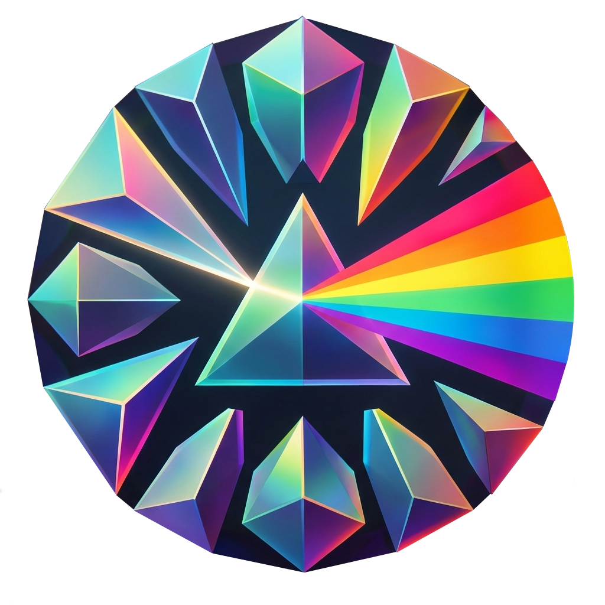
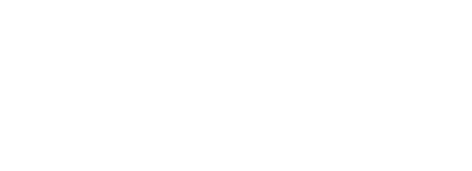

<div align="center">


<br>

**A real-time 3D sandbox for lighting rigs, driven by Art-Net**

[](./COPYING)

[](#what-is-lightyard)

[Issues](https://github.com/dinther/lightyard/issues) - [Manual](./manual.md)

</div>

---

> **Alpha.** Lightyard is early software under active development. Things move,
> break and get renamed. Please report anything odd on the
> [issue tracker](https://github.com/dinther/lightyard/issues).

---

## What is Lightyard?

Lightyard is a **sandbox for building and previewing lighting rigs in three dimensions**. You place fixtures where they will really hang, address them to real DMX universes, and watch them respond live to Art-Net from whatever is driving your show. It is a place to design a rig, prove the patch and rehearse content without a truck, a truss or a venue.

It is **not** a photo-realistic renderer, and it is not trying to be. There is no ray tracing, no measured photometrics and no attempt to predict exactly how a beam will look on a hazy stage. What it gives you is a fast, honest picture of *which fixture is doing what, where* - accurate in position, address and colour, and quick enough to sit alongside the software actually running your show.

It is also **not a lighting desk**. Lightyard does not want to replace the thing you already program with. It listens.

Lightyard is a fork of **[ASLS Studio](https://github.com/ASLS-org/studio)** by Timé Kadel, whose patching, scene, effect and chase engines it still carries. See [Acknowledgements](#acknowledgements).

---

## Features

### Lighting

#### Universe & Fixture Patching
Create and manage DMX universes, patch fixtures from a built-in library (XML fixture definitions parsed via `xml2js`), assign DMX addresses and operating modes, and adjust per-fixture settings at any time through the Universe Modifier. Channel faders allow live manipulation of any patched fixture's output including color, pan/tilt, zoom, intensity, strobe, and more.

#### Fixture Grouping
Fixtures from different universes can be combined into logical groups. Groups are the unit of cue programming: scenes and effects are defined at the group level and can span the show's entire rig.

### Common

#### Real-Time 3D Visualizer
A WebGL 2.0 viewport powered by [Three.js](https://threejs.org/) r170 and the `postprocessing` library renders the full rig in three dimensions. Fixtures respond to live channel data — position, color, beam angle, zoom, strobe, and color wheel slots are all emulated in real time. The visualizer includes volumetric beam rendering, simulated atmospheric fog with turbulence, physically-accurate or simplified light attenuation, in-viewport fixture transform controls (translate, rotate, discrete), and adjustable global scene illumination.

#### Desktop App
In addition to running as a static web app, Studio can be packaged as a native desktop application via Electron. Distribution targets are configured for Linux (arm64), macOS (arm64), and Windows (x64).

---

## Requirements

| | Minimum | Recommended |
|---|---|---|
| **RAM** | 4 GB | 8 GB or more |
| **GPU** | WebGL 1.0 support | Dedicated GPU with WebGL 2.0 |
| **Node.js** | v16.15.1 | Latest LTS |
| **Browser** | Chrome, Firefox, Opera (latest) | Chrome |
| **OS** | Any OS with Node.js support | — |

---

## Getting Started

### 1. Clone the repository

```bash
git clone https://github.com/dinther/lightyard
cd lightyard
```

### 2. Install dependencies

```bash
npm install
```

### 3. Start the development server

```bash
npm start
```

Then open [http://localhost:5173](http://localhost:5173) in your browser.

### Production build (web)

```bash
npm run build
```

Built files are placed in `./dist` and can be served by any static file host.

### Desktop distribution

```bash
# Linux (arm64)
npm run dist:linux

# macOS (arm64)
npm run dist:mac

# Windows (x64)
npm run dist:win
```

---

## Streaming to Hardware

Lightyard sends live show data using the **[WSC (Web Show Control)](https://github.com/ASLS-org/WSC)** protocol — a compact, binary, transport-agnostic protocol designed for real-time control of performance and show systems.

WSC carries multiple message types over a single connection: bulk channel data (DMX universes), linear timecode (SMPTE/MTC), cue lifecycle commands (GO, STOP, PAUSE…), typed parameter writes, and opaque binary tunnels to downstream systems. Every packet includes a Transport Descriptor that tells the gateway which downstream protocol to use — so the browser never needs to know about the physical layer.

The reference gateway (`@asls/wsc-server`) runs as a Node.js process alongside Lightyard and translates incoming WSC packets to the appropriate downstream protocol. Forwarding targets include Art-Net, sACN, DMX512, MIDI, MIDI Show Control, MIDI Timecode, OSC, and others.

Refer to the [WSC repository](https://github.com/ASLS-org/WSC) and its JavaScript implementation guide for gateway setup instructions.

---


## Tech Stack

| Layer | Technology |
|---|---|
| UI Framework | [Vue 3](https://vuejs.org/) |
| 3D Visualizer | [Three.js](https://threejs.org/) r170 + WebGL 2.0 + GLSL + [postprocessing](https://github.com/pmndrs/postprocessing) |
| Build Tool | [Vite](https://vitejs.dev/) |
| Desktop Shell | [Electron](https://www.electronjs.org/) v41 via `electron-vite` + `electron-builder` |
| Show Output | [WSC](https://github.com/ASLS-org/WSC) via `@asls/wsc-client` / `@asls/wsc-sdk` |
| Fixture Definitions | XML parsing via `xml2js` |
| Event Bus | `mitt` |

---

## Contributing

Contributions of all kinds are welcome — bug reports, feature requests, fixture library additions, documentation improvements, and code.

1. **Fork** the repository and create a branch off `develop`.
2. Make your changes and test them locally (`npm start`).
3. Open a **Pull Request** against `develop` with a clear description of the change and why.

For larger changes or new features, opening a [Discussion](https://github.com/dinther/lightyard/discussions) first is encouraged to align on direction before writing code.

---

## License

Lightyard is released under the **GNU General Public License v3.0**, the licence it inherits from ASLS Studio. See the [`COPYING`](./COPYING) file for full terms.

Copyright (c) 2026 Paul van Dinther. Portions copyright (c) ASLS-org / Timé Kadel, 2021.

---

## Acknowledgements

Lightyard is built on **[ASLS Studio](https://github.com/ASLS-org/studio)** by [Timé Kadel](https://github.com/timekadel), which grew out of the ASLS research project and was made freely available to the lighting and open-source communities. Its patching, scene, effect and chase engines, its UI kit and the first version of its visualizer are the foundation everything here stands on.

Lightyard adds Art-Net input, a rebuilt visualizer, generic LED fixtures, per-group export mappings, and the MadMapper layout and fixture-library export. Third-party library credits are listed in [`CREDITS.html`](./CREDITS.html).
